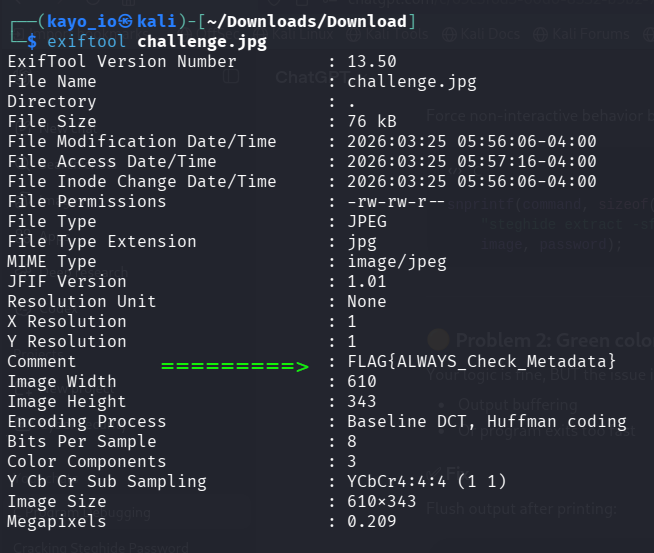
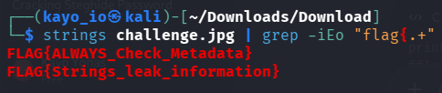
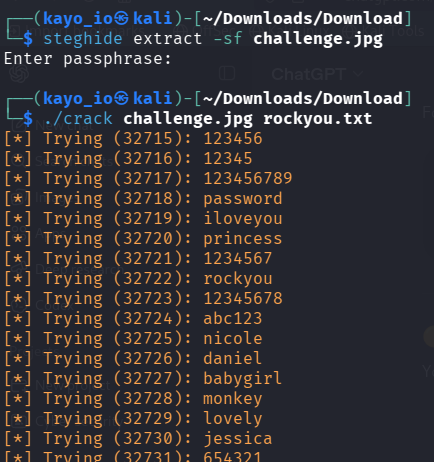
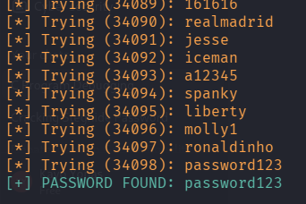
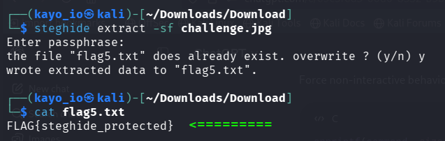
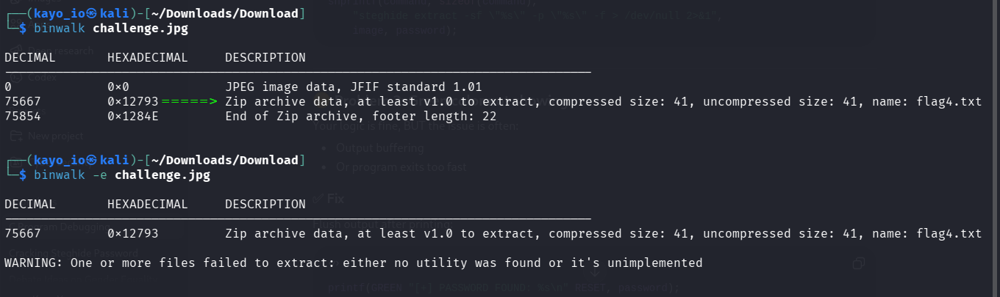
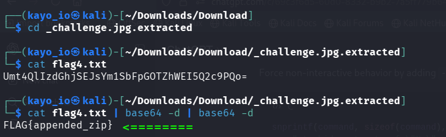

# INSA-CTF - Image Extraction 

> **Discription**: The are 4 flags hidden inside the image proided below in the format FLAG{...}

---

## Initial Observation

The contained contained:
- Normal-looking toy character  
- **Hints:**  
- "The first 2 flag require implementation of today's class on extracting information from a data."  
- "To retrieve the remaining 2, read on Steganography and what tools to use to extract information from an image."  

This suggested that to find the flag the knowledge of Steganography.

---

## Approach

### Step 1: Check Metadata

> using a tool called **exiftool** extracted the metadata of the image.

**Result**: Flag one was placed in the _comment_ section of the metadata.

**Flag-1**: "FLAG{ALWAYS_Check_Metadata}"

### Step 2: Extracting the image using "strings" command

- beside the **strings** cmd I used **grep** cmd to filter the flag using regex.
 
**Result**: There were 2 flags. one is the same as **flag-1** and the second will be the **flag-2**.

**Flag-2**: "FLAG{Strings\_leak\_information}"

### Step 3: Using "steghide" tool

- after using the **steghide** tool it asks for "**pass phrase**".  
- to crack the password I used the tool called **crack** which was created by me.  
- if you need you can get the tool in **tools** folder.  

##### The magic of "cracker":

- the tool(**crack**) finally gave me the correct password.

##### The captured flag:

- after entering the **password** I got another file called **flag5.txt**.  
- and **flag-5** was placed in that txt file.

**Flag-5**: "FLAG{steghide_protected}"  

### Step 4: The last Flag:

- Using a tool called **"binwalk"** I knew there were another zip file hidden in this image.  
- Then after extraction, I got a file called **"flag4.txt"**.

- After opening the **flag4.txt** I found a Base64 text which is coded two times.  
- Finally I decoded two times using "**base64 -d**" command.

**Flag-4**: "FLAG{appended_zip}"

### Tools Used:

* crack - the program which is coded by me to crack the password.  
* cat - to read file content  
* exiftool - to see files metadata.  
* strings - to see inside the file detail.  
* steghide - to extract the file into a bit.  
* grep - to filter the flag.  
* binwalk - to see if there is another hiden file and extract it.

### Lessons I learned:

- to find what you want you dont have to giveup, you have to find deeply.  
- use different tools to find the flags  
- check every part of the image even if you think there is no flag there.

